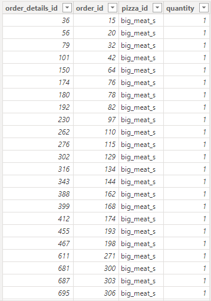
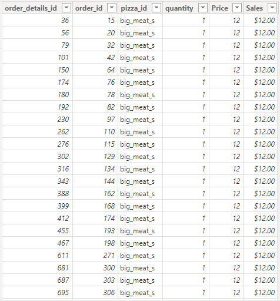
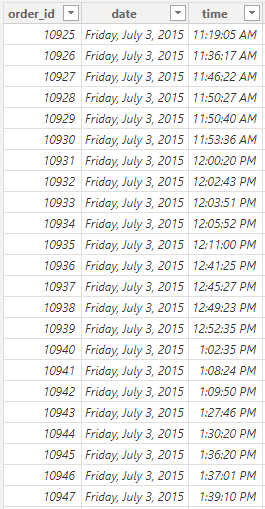
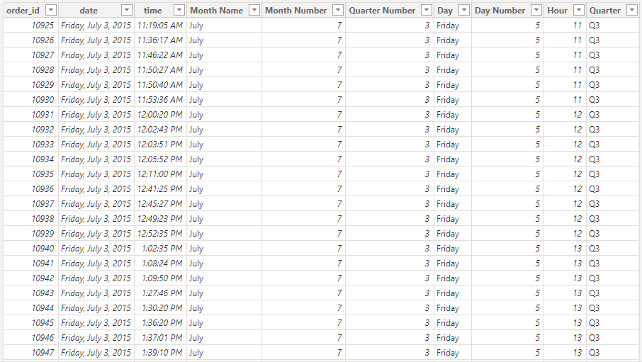
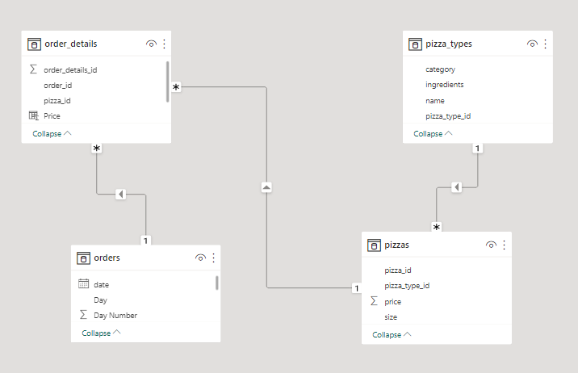
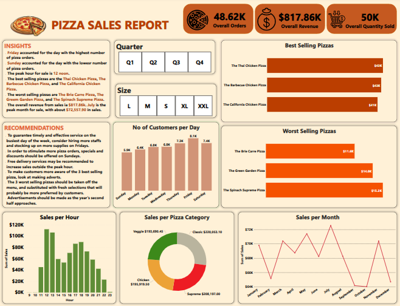

# Pizza-Sales-Analysis

# Introduction
This is the documentation of a project on sales analysis of a fictitious pizza place. The project is to analyze and derive meaningful insights to answer crucial questions and help the fictitious pizza place make data driven decisions.

# Skills/Concepts demonstrated
The following Power BI features were incorporated:
- Dax functions (CALCULATE, AVERAGE, RELATED, and SUM) were used.
- Quick Measure
- Filter
- Power Query editor
- Data Modelling star schema
- Connecting slicers with the report
- Visualization charts

# Problem Statements
1. How many customers do we have each day? Are there any peak hours?
2. How many pizzas are typically in an order? Do we have any bestsellers?
3. How much money did we make this year? Can we identify any seasonality in the sales?
4. Are there any pizzas we should take off the menu, or any promotions we could leverage?

# Data Description
The dataset contains three (3) dimensional tables (orders, pizza_types, pizzas), and one (1) fact table (order_details). The order_details' table contains 48,620 rows; 4 columns, the orders' table contains has 21,350 rows; 3 columns, the Pizza_types' table contains 33 rows; 4 columns, and the Pizzas' table contains 96 rows; 4 columns.

The Pizza Place Sales dataset was sourced from [Maven Analytics](https://www.mavenanalytics.io/).

# Data Cleaning/Transformation

The dataset was efficiently cleaned using the Microsoft Power Query Editor of Microsoft Power  BI. The applied steps includes:

- ### **The pizza_type table**

I used the first row as header to better understand each column.

- ### **The order_details table**

I created the Price column and Sales columns using a DAX function:
 
Price column:

`Price = RELATED(pizzas[price])`

Sales column:

`Sales = orders_details[price]*orders_details[Quantity]` Then, I changed the format to currency in Dollars($).

Before                    | After
:------------------------:|:------------------:
   |   

- ### **The orders table**

I derived the Months Name, Month Number, Quarter Number, Quarter, Days, Days Number Quarter and Hours columns:

**STEPS**

**1. Months Name**

I. Duplicate the Date column

II. Right click on the duplicated column

III. Select transform

IV. Select Month

V. Select Name of Month

**2. Months Number**

I. Duplicate the Date column

II. Right click on the duplicated column

III. Select transform

IV. Select Month

V. Select Month

**3. Quarter Number**

I. Duplicate the Date column

II. Right click on the duplicated column

III. Select transform

IV. Select Quarter

V. Select Quarter

**4. Quarter**

I created the Quarter Number column using a DAX function: `Quarter = "Q" & orders[Quarter Number]`

**5. Days**

I. Duplicate the Date column

II. Right click on the duplicated column

III. Select transform

IV. Select Day

V. Select Name of Day

**6. Day Number**

I. Duplicate the Date column

II. Right click on the duplicated column

III. Select transform

IV. Select Day

V. Select Day

**7. Hours**

I. Duplicate the Time column

II. Right Click on the Duplicated column

III. Select Transform

IV. Select Hour

V. Select Hour

Before                    | After
:------------------------:|:------------------:
   |   

# Data Modelling

The model is a star schema. There are three (3) dimensional tables (orders, pizza_types, pizzas), and one (1) fact table (order_details). The dimensional tables are all joined to the fact table in a one-to-many relationship.

# Analysis & Visualization

You can interact with the report [here](https://app.powerbi.com/groups/me/reports/17475cab-67be-4ef9-b76a-ea7148214410/ReportSection?experience=power-bi)

